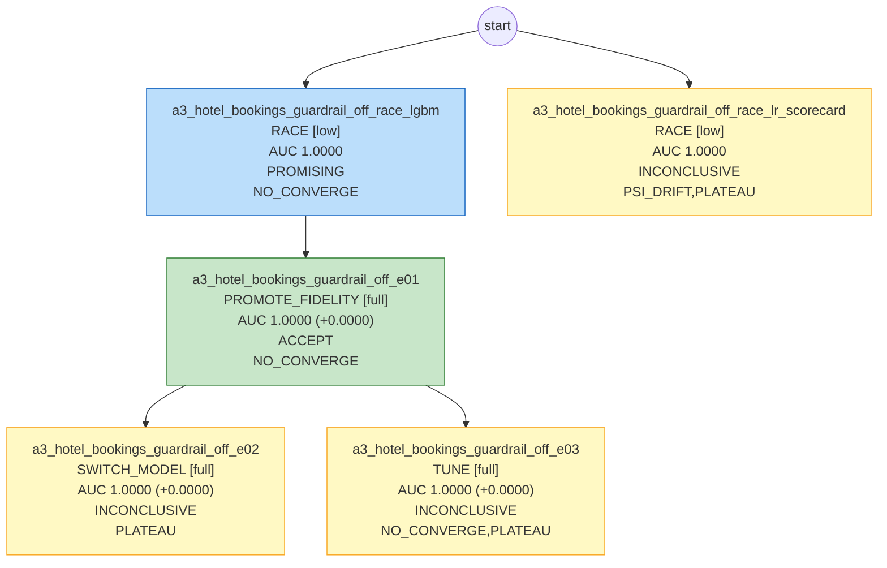

# 模型卡：a3_hotel_bookings_guardrail_off

> 数据集 `hotel_bookings`；本文档数据全部由代码生成。

## 执行摘要

本次共运行 5 个实验，其中 1 个被接受。最终模型为 lgbm，OOT-dev AUC 为 1.0。

## 1. 任务规格

| 项 | 值 |
|---|---|
| label 定义 | 预订最终被取消（通常包含 No-Show），加载时用 reservation_status 校验该对应关系，校验后 reservation_status 立即剔除 |
| 观察时间列 | arrival_date - lead_time |
| OOT 窗口 | {"oot_dev": ["2017-01", "2017-04"], "holdout": ["2017-05", "2017-08"]} |
| 目标指标 | auc（目标值 None） |
| 约束 | {'interpretability': 'none', 'max_features': None, 'banned_models': []} |
| 预算 | {'tokens': 200000.0, 'cpu_minutes': 240.0, 'wall_minutes': 120.0} |
| 自治级别 | L0 |

## 2. 数据切分

| 切分 | 样本数 | 坏样本率 |
|---|---|---|
| train | 62,963 | 0.3612 |
| valid | 15,740 | 0.3644 |
| oot_dev | 18,489 | 0.3648 |
| holdout（仅 final_gate） | 22,198 | 0.4055 |

## 3. 最终模型

- 实验：`a3_hotel_bookings_guardrail_off_e01`；模型：`lgbm`；保真度：full；trial 数：15（剪枝 0）
- 特征数：38；最优参数：`{"learning_rate": 0.05176340429875833, "num_leaves": 57, "min_child_samples": 138, "feature_fraction": 0.7724415914984484, "bagging_fraction": 0.7118273996694524, "lambda_l2": 1.6961746387290992}`

## 4. 各段指标

| 段 | AUC | KS |
|---|---|---|
| train | 1.0000 | |
| valid | 1.0000 | |
| OOT-dev | 1.0000 | 1.0000 |
| holdout | 1.0000 | 1.0000 |

- valid − OOT-dev gap：0.0000；分数 PSI（valid→OOT-dev）：0.0000；OOT-dev 使用次数：3

## 5. 分月 AUC、坏样本率与分数 PSI

（月份按 `_split_time` 划分）

| 月份 | 段 | n | AUC | 坏样本率 | 去年同期坏样本率 | 分数 PSI（相对 valid） |
|---|---|---|---|---|---|---|
| 2017-01 | OOT-dev | 3681 | 1.0000 | 0.340 | 0.248 | 0.0000 |
| 2017-02 | OOT-dev | 4177 | 1.0000 | 0.325 | 0.344 | 0.0000 |
| 2017-03 | OOT-dev | 4970 | 1.0000 | 0.336 | 0.306 | 0.0000 |
| 2017-04 | OOT-dev | 5661 | 1.0000 | 0.435 | 0.380 | 0.0000 |
| 2017-05 | holdout | 6313 | 1.0000 | 0.438 | 0.350 | |
| 2017-06 | holdout | 5647 | 1.0000 | 0.432 | 0.396 | |
| 2017-07 | holdout | 5313 | 1.0000 | 0.373 | 0.328 | |
| 2017-08 | holdout | 4925 | 1.0000 | 0.369 | 0.360 | |

> 酒店业务季节性很强：oot_dev 覆盖冬春，holdout 覆盖夏季。OOT 上的漂移有一部分来自季节而非模型退化， 报告中需要按月份对比同期（2016 年同月）的坏样本率，区分季节效应与真实漂移。

## 6. 特征清单（按平均 |SHAP| 排序）

| 特征 | 来源 | 定义/说明 | IV | 贡献占比 | 备注 |
|---|---|---|---|---|---|
| reservation_status | 原始字段 |  | 21.883 | 100.0% |  |
| hotel | 原始字段 | categorical | 0.100 | 0.0% |  |
| lead_time | 原始字段 | numeric | 0.663 | 0.0% |  |
| arrival_date_month | 原始字段 | categorical | 0.022 | 0.0% |  |
| arrival_date_week_number | 原始字段 | numeric | 0.021 | 0.0% |  |
| arrival_date_day_of_month | 原始字段 | numeric | 0.003 | 0.0% |  |
| stays_in_weekend_nights | 原始字段 | 对已入住的订单，可能反映实际入住晚数而非预订晚数；列入审查 | 0.001 | 0.0% |  |
| stays_in_week_nights | 原始字段 | 同上 | 0.070 | 0.0% |  |
| adults | 原始字段 | numeric | 0.031 | 0.0% |  |
| children | 原始字段 | 有少量缺失 | 0.000 | 0.0% |  |
| babies | 原始字段 | numeric | 0.000 | 0.0% |  |
| meal | 原始字段 | Undefined 与 SC 含义相同，合并 | 0.014 | 0.0% |  |
| country | 原始字段 | 社区中广为讨论：国籍可能在入住时才确认，被取消订单的取值可能有偏向性默认值；同时属于国籍信息。默认隔离 | 0.753 | 0.0% |  |
| market_segment | 原始字段 | categorical | 0.384 | 0.0% |  |
| distribution_channel | 原始字段 | categorical | 0.157 | 0.0% |  |
| is_repeated_guest | 原始字段 | binary | 0.000 | 0.0% |  |
| previous_cancellations | 原始字段 | numeric | 0.000 | 0.0% |  |
| previous_bookings_not_canceled | 原始字段 | numeric | 0.000 | 0.0% |  |
| reserved_room_type | 原始字段 | categorical | 0.040 | 0.0% |  |
| assigned_room_type | 原始字段 | 入住时分配；与 reserved_room_type 不一致几乎只出现在已入住的订单中 | 0.293 | 0.0% |  |
| booking_changes | 原始字段 | 累计到入住或取消为止 | 0.041 | 0.0% |  |
| deposit_type | 原始字段 | 数据中 Non Refund 的取消率反直觉地高（可能与团体/渠道订单有关）。critic 标注但不自动剔除 | 2.083 | 0.0% |  |
| agent | 原始字段 | ID，高基数，含 NULL 字符串 | 0.910 | 0.0% |  |
| company | 原始字段 | ID，高基数，大量 NULL | 0.106 | 0.0% |  |
| days_in_waiting_list | 原始字段 | numeric | 0.000 | 0.0% |  |
| customer_type | 原始字段 | categorical | 0.049 | 0.0% |  |
| adr | 原始字段 | 平均每日房价；对已入住订单可能按实际消费计算。有负值和极端值 | 0.096 | 0.0% |  |
| required_car_parking_spaces | 原始字段 | 被取消的订单几乎全为 0，疑似入住时才登记 | 0.000 | 0.0% |  |
| total_of_special_requests | 原始字段 | numeric | 0.081 | 0.0% |  |
| reservation_status_date | 原始字段 |  | 0.406 | 0.0% |  |
| total_nights | 原始字段 |  | 0.108 | 0.0% |  |
| total_guests | 原始字段 |  | 0.042 | 0.0% |  |
| has_kids | 原始字段 |  | 0.000 | 0.0% |  |
| weekend_share | 原始字段 |  | 0.047 | 0.0% |  |
| cancel_history_ratio | 原始字段 |  | 0.312 | 0.0% |  |
| booking_month | 原始字段 |  | 0.036 | 0.0% |  |
| price_per_guest | 原始字段 |  | 0.117 | 0.0% |  |
| room_mismatch | 原始字段 |  | 0.000 | 0.0% |  |

## 7. 实验树

| 实验 | 父节点 | 动作 | 保真度 | OOT-dev AUC | 判定 | 诊断码 |
|---|---|---|---|---|---|---|
| a3_hotel_bookings_guardrail_off_race_lgbm | - | RACE | low | 1.0000 | PROMISING | NO_CONVERGE |
| a3_hotel_bookings_guardrail_off_race_lr_scorecard | - | RACE | low | 1.0000 | INCONCLUSIVE | PSI_DRIFT,PLATEAU |
| a3_hotel_bookings_guardrail_off_e01 | a3_hotel_bookings_guardrail_off_race_lgbm | PROMOTE_FIDELITY | full | 1.0000 | ACCEPT | NO_CONVERGE |
| a3_hotel_bookings_guardrail_off_e02 | a3_hotel_bookings_guardrail_off_e01 | SWITCH_MODEL | full | 1.0000 | INCONCLUSIVE | PLATEAU |
| a3_hotel_bookings_guardrail_off_e03 | a3_hotel_bookings_guardrail_off_e01 | TUNE | full | 1.0000 | INCONCLUSIVE | NO_CONVERGE,PLATEAU |

## 8. 风险提示

- 单个特征 `reservation_status` 贡献占比 100% > 40%（sanity_rules）。
- 合规待审字段在最终特征中：country。
- 停止原因：LLM_STOP: mock: 剩余方向期望价值低于成本。
