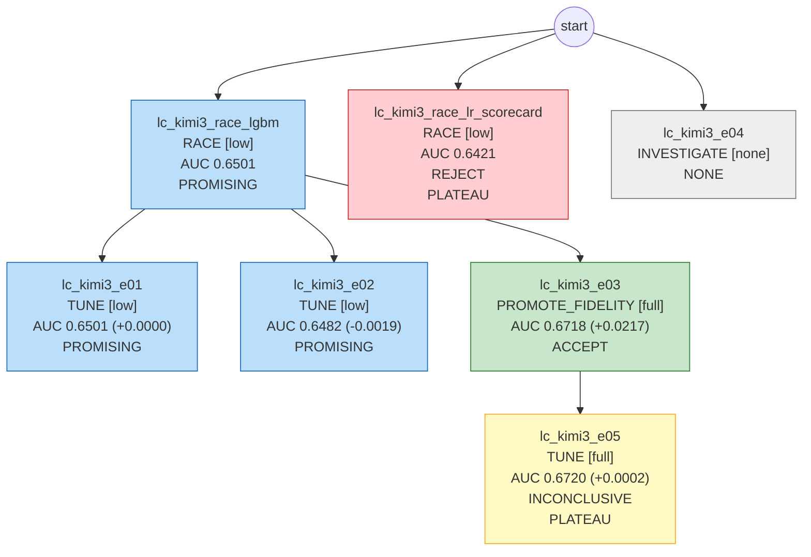

# 模型卡：lc_kimi3

> 数据集 `lending_club`；本文档数据全部由代码生成。

## 执行摘要

本次实验基于 lending_club 数据集开展，共运行 7 组实验，其中 1 组被接受。最优实验为 lc_kimi3_e03，采用 lgbm 模型。该实验使用了 2 个 OOT 数据集，其 OOT 开发集 AUC 为 0.6718，holdout 集 AUC 为 0.6772。实验因达到最大轮数（MAX_ROUNDS）而停止。

## 1. 任务规格

| 项 | 值 |
|---|---|
| label 定义 | 36 期贷款在到期前是否发生 Charged Off 或 Default |
| 观察时间列 | issue_d |
| OOT 窗口 | {"oot_dev": ["2015-01", "2015-06"], "holdout": ["2015-07", "2015-12"]} |
| 目标指标 | auc（目标值 None） |
| 约束 | {'interpretability': 'none', 'max_features': None, 'banned_models': []} |
| 预算 | {'tokens': 200000.0, 'cpu_minutes': 240.0, 'wall_minutes': 120.0} |
| 自治级别 | L1 |

## 2. 数据切分

| 切分 | 样本数 | 坏样本率 |
|---|---|---|
| train | 245,170 | 0.1327 |
| valid | 61,292 | 0.1317 |
| oot_dev | 120,790 | 0.1512 |
| holdout（仅 final_gate） | 162,236 | 0.1471 |

## 3. 最终模型

- 实验：`lc_kimi3_e03`；模型：`lgbm`；保真度：full；trial 数：15（剪枝 10）
- 特征数：35；最优参数：`{"learning_rate": 0.05176340429875833, "num_leaves": 57, "min_child_samples": 138, "feature_fraction": 0.7724415914984484, "bagging_fraction": 0.7118273996694524, "lambda_l2": 1.6961746387290992}`

## 4. 各段指标

| 段 | AUC | KS |
|---|---|---|
| train | 0.7635 | |
| valid | 0.6748 | |
| OOT-dev | 0.6718 | 0.2495 |
| holdout | 0.6772 | 0.2553 |

- valid − OOT-dev gap：0.0030；分数 PSI（valid→OOT-dev）：0.0024；OOT-dev 使用次数：2

## 5. 分月 AUC、坏样本率与分数 PSI

（月份按 `_split_time` 划分）

| 月份 | 段 | n | AUC | 坏样本率 | 去年同期坏样本率 | 分数 PSI（相对 valid） |
|---|---|---|---|---|---|---|
| 2015-01 | OOT-dev | 23631 | 0.6736 | 0.149 | 0.125 | 0.0046 |
| 2015-02 | OOT-dev | 16023 | 0.6707 | 0.142 | 0.129 | 0.0044 |
| 2015-03 | OOT-dev | 16914 | 0.6702 | 0.154 | 0.132 | 0.0043 |
| 2015-04 | OOT-dev | 23619 | 0.6691 | 0.155 | 0.134 | 0.0015 |
| 2015-05 | OOT-dev | 21539 | 0.6705 | 0.152 | 0.134 | 0.0025 |
| 2015-06 | OOT-dev | 19064 | 0.6774 | 0.154 | 0.139 | 0.0019 |
| 2015-07 | holdout | 30864 | 0.6762 | 0.146 | 0.135 | |
| 2015-08 | holdout | 23938 | 0.6768 | 0.142 | 0.135 | |
| 2015-09 | holdout | 18765 | 0.6827 | 0.149 | 0.142 | |
| 2015-10 | holdout | 33186 | 0.6735 | 0.141 | 0.149 | |
| 2015-11 | holdout | 25242 | 0.6800 | 0.148 | 0.142 | |
| 2015-12 | holdout | 30241 | 0.6760 | 0.156 | 0.138 | |

## 6. 特征清单（按平均 |SHAP| 排序）

| 特征 | 来源 | 定义/说明 | IV | 贡献占比 | 备注 |
|---|---|---|---|---|---|
| fico_range_low | 原始字段 | numeric | 0.128 | 13.6% |  |
| annual_inc | 原始字段 | 长尾分布，建议对数变换或分箱 | 0.085 | 10.7% |  |
| dti | 原始字段 | 存在极端值和负值，需要截断 | 0.048 | 8.4% |  |
| inq_last_6mths | 原始字段 | numeric | 0.020 | 7.0% |  |
| open_acc | 原始字段 | numeric | 0.000 | 5.9% |  |
| addr_state | 原始字段 | categorical | 0.014 | 5.5% |  |
| loan_amnt | 原始字段 | numeric | 0.008 | 4.7% |  |
| purpose | 原始字段 | categorical | 0.024 | 4.7% |  |
| total_rev_hi_lim | 原始字段 | numeric | 0.052 | 4.3% |  |
| tot_cur_bal | 原始字段 | numeric | 0.056 | 4.2% |  |
| fico_range_high | 原始字段 | 与 low 几乎完全相关，二选一或取均值 | 0.128 | 3.4% |  |
| home_ownership | 原始字段 | OTHER/NONE/ANY 样本极少，合并处理 | 0.039 | 3.2% |  |
| verification_status | 原始字段 | categorical | 0.009 | 3.1% |  |
| emp_length | 原始字段 | 'n/a' 与缺失需区分 | 0.018 | 3.1% |  |
| mths_since_last_delinq | 原始字段 | 缺失表示从未逾期，不是随机缺失 | 0.001 | 2.9% |  |
| funded_amnt | 原始字段 | 通常与 loan_amnt 高度相关 | 0.008 | 2.7% |  |
| revol_bal | 原始字段 | numeric | 0.018 | 2.5% |  |
| total_acc | 原始字段 | numeric | 0.009 | 2.4% |  |
| earliest_cr_line | 原始字段 | 派生信用历史长度 = issue_d - earliest_cr_line | 0.045 | 2.2% |  |
| revol_util | 原始字段 | 原始数据可能是带 % 的字符串 | 0.021 | 1.9% |  |
| mths_since_last_record | 原始字段 | 缺失表示无公共记录 | 0.003 | 1.5% |  |
| tot_coll_amt | 原始字段 | numeric | 0.002 | 0.9% |  |
| initial_list_status | 原始字段 | categorical | 0.001 | 0.4% |  |
| pub_rec_bankruptcies | 原始字段 | numeric | 0.001 | 0.4% |  |
| delinq_2yrs | 原始字段 | numeric | 0.001 | 0.2% |  |
| collections_12_mths_ex_med | 原始字段 | numeric | 0.000 | 0.1% |  |
| pub_rec | 原始字段 | numeric | 0.000 | 0.1% |  |
| acc_now_delinq | 原始字段 | numeric | 0.000 | 0.0% |  |
| term | 原始字段 | 主实验固定为 36 期，切分后为常量 | 0.000 | 0.0% |  |
| application_type | 原始字段 | categorical | 0.000 | 0.0% |  |
| open_acc_6m | 原始字段 | numeric | 0.000 | 0.0% |  |
| open_il_12m | 原始字段 | numeric | 0.000 | 0.0% |  |
| il_util | 原始字段 | numeric | 0.000 | 0.0% |  |
| all_util | 原始字段 | numeric | 0.000 | 0.0% |  |
| inq_last_12m | 原始字段 | numeric | 0.000 | 0.0% |  |

## 7. 实验树

| 实验 | 父节点 | 动作 | 保真度 | OOT-dev AUC | 判定 | 诊断码 |
|---|---|---|---|---|---|---|
| lc_kimi3_race_lgbm | - | RACE | low | 0.6501 | PROMISING |  |
| lc_kimi3_race_lr_scorecard | - | RACE | low | 0.6421 | REJECT | PLATEAU |
| lc_kimi3_e01 | lc_kimi3_race_lgbm | TUNE | low | 0.6501 | PROMISING |  |
| lc_kimi3_e02 | lc_kimi3_race_lgbm | TUNE | low | 0.6482 | PROMISING |  |
| lc_kimi3_e03 | lc_kimi3_race_lgbm | PROMOTE_FIDELITY | full | 0.6718 | ACCEPT |  |
| lc_kimi3_e04 | - | INVESTIGATE | none | - | NONE |  |
| lc_kimi3_e05 | lc_kimi3_e03 | TUNE | full | 0.6720 | INCONCLUSIVE | PLATEAU |

## 8. 风险提示

- 合规待审字段在最终特征中：addr_state。
- 停止原因：MAX_ROUNDS。
