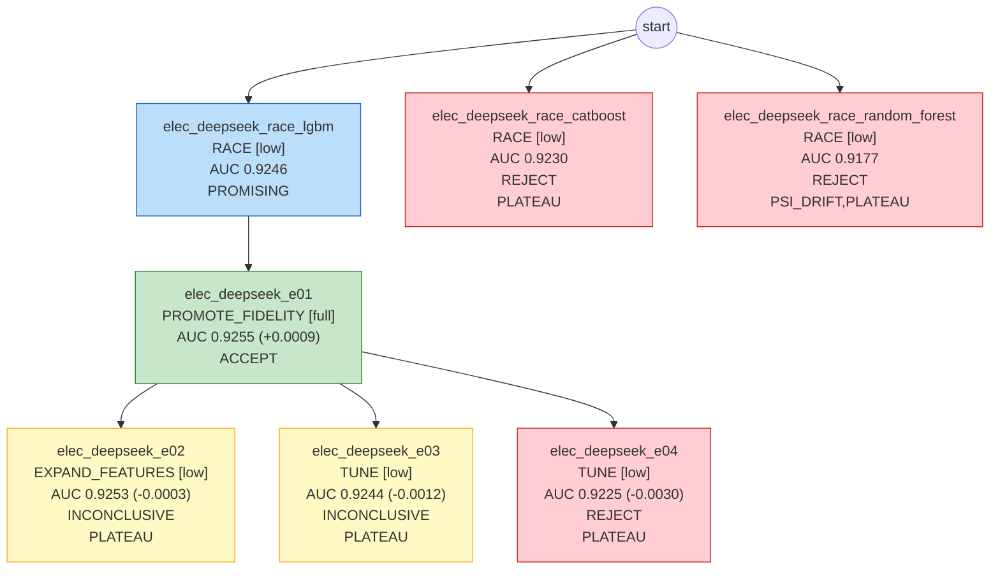

# 模型卡：elec_deepseek

> 数据集 `electricity_nsw`；本文档数据全部由代码生成。

## 执行摘要

本次任务是对用电相关业务的未来结果做预测，重点是把更可能发生的目标事件排在前面，方便业务优先跟进。整个过程中共尝试了 7 组建模方案，其中 1 组通过评估被采纳，并在 5 次时间外验证中反复比较，最终选用梯度提升树模型。时间外验证的区分能力得分为 0.9255，最终检验的得分为 0.9285，两者非常接近且最终检验略高，说明模型表现稳定，没有明显过拟合。需要留意的是，后续迭代未能继续带来提升，方案本身的可优化空间已经有限；同时结论只来自这一组被采纳的模型，上线后建议持续观察数据变化对效果的影响。

## 1. 任务规格

| 项 | 值 |
|---|---|
| label 定义 | 该半小时 NSW 电价相对过去 24 小时平均电价上涨记为 UP，否则记为 DOWN |
| 观察时间 | "timestamp" |
| OOT 窗口 | {"oot_dev": ["1998-01", "1998-06"], "holdout": ["1998-07", "1998-12"]} |
| 目标指标 | auc（护栏 {'pr_auc': 0.02}，目标值 None） |
| 约束 | {'interpretability': 'none', 'max_features': None, 'banned_models': []} |
| 预算 | {'tokens': 200000.0, 'cpu_minutes': 240.0, 'wall_minutes': 120.0} |
| 自治级别 | L0 |

## 2. 数据切分

| 切分 | 样本数 | 正类比例 |
|---|---|---|
| train | 23,194 | 0.4221 |
| valid | 5,798 | 0.4341 |
| oot_dev | 8,688 | 0.3827 |
| holdout（仅 final_gate） | 7,632 | 0.4724 |

## 3. 最终模型

- 实验：`elec_deepseek_e01`；模型：`lgbm`；保真度：full；trial 数：5（剪枝 0）
- 特征数：22；最优参数：`{"learning_rate": 0.017578207059645252, "num_leaves": 98, "min_child_samples": 187, "feature_fraction": 0.5327366590584757, "bagging_fraction": 0.656243337496135, "lambda_l2": 0.006786606886795015}`

## 4. 各段指标

| 段 | **AUC** | PR_AUC | KS |
|---|---|---|---|
| train | **0.9611** | 0.9493 | 0.7777 |
| valid | **0.9350** | 0.9178 | 0.7233 |
| OOT-dev | **0.9255** | 0.8862 | 0.7191 |
| holdout | **0.9285** | 0.9183 | 0.7135 |

- valid − OOT-dev gap：0.0095；分数 PSI（valid→OOT-dev）：0.0554；OOT-dev 使用次数：5
- 补充参考指标（holdout，只报告、不参与选模型）：分数最高的头部 10% 里正类浓度是整体的 2.08 倍，覆盖 21% 的正类；Brier 分数 0.1070（越小说明预测概率越接近实际）

## 5. 分月 AUC、正类比例与分数 PSI

（月份按 `_split_time` 划分）

| 月份 | 段 | n | AUC | 正类比例 | 去年同期正类比例 | 分数 PSI（相对 valid） |
|---|---|---|---|---|---|---|
| 1998-01 | OOT-dev | 1488 | 0.9427 | 0.390 | 0.495 | 0.0968 |
| 1998-02 | OOT-dev | 1344 | 0.9110 | 0.390 | 0.484 | 0.0733 |
| 1998-03 | OOT-dev | 1488 | 0.9463 | 0.465 | 0.426 | 0.0696 |
| 1998-04 | OOT-dev | 1440 | 0.9325 | 0.392 | 0.358 | 0.0322 |
| 1998-05 | OOT-dev | 1488 | 0.8996 | 0.319 | 0.402 | 0.2802 |
| 1998-06 | OOT-dev | 1440 | 0.9186 | 0.340 | 0.492 | 0.1544 |
| 1998-07 | holdout | 1488 | 0.9343 | 0.450 | 0.347 | |
| 1998-08 | holdout | 1488 | 0.9224 | 0.549 | 0.389 | |
| 1998-09 | holdout | 1440 | 0.9162 | 0.526 | 0.369 | |
| 1998-10 | holdout | 1488 | 0.9384 | 0.430 | 0.440 | |
| 1998-11 | holdout | 1440 | 0.9330 | 0.403 | 0.423 | |
| 1998-12 | holdout | 288 | 0.9057 | 0.486 | 0.384 | |

## 6. 特征清单（按平均 |SHAP| 排序）

| 特征 | 来源 | 定义/说明 | IV | 贡献占比 | 备注 |
|---|---|---|---|---|---|
| price_direction_lag1 | 派生特征（classic_derived） | LAG(CASE WHEN "price_direction"::VARCHAR IN ('UP') THEN 1 WHEN "price_ | 0.000 | 17.8% |  |
| nsw_price_lag1 | 派生特征（classic_derived） | LAG("nsw_price", 1) OVER (__HIST__) | 0.894 | 11.6% |  |
| vic_price_mean48 | 派生特征（classic_derived） | AVG("vic_price") OVER (__HIST__ ROWS BETWEEN 48 PRECEDING AND 1 PRECED | 0.021 | 10.8% |  |
| nsw_price_mean48 | 派生特征（classic_derived） | AVG("nsw_price") OVER (__HIST__ ROWS BETWEEN 48 PRECEDING AND 1 PRECED | 0.044 | 10.4% |  |
| price_direction_lag2 | 派生特征（classic_derived） | LAG(CASE WHEN "price_direction"::VARCHAR IN ('UP') THEN 1 WHEN "price_ | 0.000 | 8.0% |  |
| period | 原始字段 | 一天 48 个半小时的序号，属于日历信息，预测时已知。 | 0.620 | 5.6% |  |
| transfer | 原始字段 | 业务说明明确这是两州之间“计划”输送量，预测时点已知，可直接作为特征。 | 0.092 | 5.5% |  |
| nsw_price_lag48 | 派生特征（classic_derived） | LAG("nsw_price", 48) OVER (__HIST__) | 0.161 | 4.6% |  |
| nsw_demand_lag1 | 派生特征（classic_derived） | LAG("nsw_demand", 1) OVER (__HIST__) | 0.436 | 3.9% |  |
| vic_price_lag1 | 派生特征（classic_derived） | LAG("vic_price", 1) OVER (__HIST__) | 0.304 | 3.7% |  |
| price_direction_mean48 | 派生特征（classic_derived） | AVG(CASE WHEN "price_direction"::VARCHAR IN ('UP') THEN 1 WHEN "price_ | 0.218 | 2.8% |  |
| vic_demand_lag48 | 派生特征（classic_derived） | LAG("vic_demand", 48) OVER (__HIST__) | 0.057 | 2.2% |  |
| nsw_demand_mean48 | 派生特征（classic_derived） | AVG("nsw_demand") OVER (__HIST__ ROWS BETWEEN 48 PRECEDING AND 1 PRECE | 0.038 | 2.1% |  |
| vic_price_lag48 | 派生特征（classic_derived） | LAG("vic_price", 48) OVER (__HIST__) | 0.059 | 2.0% |  |
| vic_demand_lag2 | 派生特征（classic_derived） | LAG("vic_demand", 2) OVER (__HIST__) | 0.111 | 1.8% |  |
| nsw_demand_lag2 | 派生特征（classic_derived） | LAG("nsw_demand", 2) OVER (__HIST__) | 0.295 | 1.5% |  |
| vic_price_lag2 | 派生特征（classic_derived） | LAG("vic_price", 2) OVER (__HIST__) | 0.209 | 1.2% |  |
| nsw_demand_lag48 | 派生特征（classic_derived） | LAG("nsw_demand", 48) OVER (__HIST__) | 0.291 | 1.0% |  |
| vic_demand_lag1 | 派生特征（classic_derived） | LAG("vic_demand", 1) OVER (__HIST__) | 0.149 | 1.0% |  |
| day_of_week | 原始字段 | 星期几由日历决定，预测时已知。 | 0.022 | 0.9% |  |
| vic_demand_mean48 | 派生特征（classic_derived） | AVG("vic_demand") OVER (__HIST__ ROWS BETWEEN 48 PRECEDING AND 1 PRECE | 0.019 | 0.9% |  |
| nsw_price_lag2 | 派生特征（classic_derived） | LAG("nsw_price", 2) OVER (__HIST__) | 0.617 | 0.7% |  |

## 7. 实验树

| 实验 | 父节点 | 动作 | 保真度 | OOT-dev AUC | 判定 | 诊断码 |
|---|---|---|---|---|---|---|
| elec_deepseek_race_lgbm | - | RACE | low | 0.9246 | PROMISING |  |
| elec_deepseek_race_catboost | - | RACE | low | 0.9230 | REJECT | PLATEAU |
| elec_deepseek_race_random_forest | - | RACE | low | 0.9177 | REJECT | PSI_DRIFT,PLATEAU |
| elec_deepseek_e01 | elec_deepseek_race_lgbm | PROMOTE_FIDELITY | full | 0.9255 | ACCEPT |  |
| elec_deepseek_e02 | elec_deepseek_e01 | EXPAND_FEATURES | low | 0.9253 | INCONCLUSIVE | PLATEAU |
| elec_deepseek_e03 | elec_deepseek_e01 | TUNE | low | 0.9244 | INCONCLUSIVE | PLATEAU |
| elec_deepseek_e04 | elec_deepseek_e01 | TUNE | low | 0.9225 | REJECT | PLATEAU |

## 8. 风险提示

- 停止原因：NO_PROGRESS。

## 9. 模型设定（复现用）

用下面的设定，在同样的切分数据上可以重新训练出最终模型。

- 模型：lgbm。通用强基线，数值与低基数类别都能处理；叶子数大时容易在同期验证集上过拟合。
- 训练：目标函数 binary，缺失值和类别列交给 LightGBM 原生处理；在 train 段训练，valid 段早停（连续 50 轮没有提升就停，最多 500 棵树），实际用了 495 棵树；随机种子 0。
- 训练数据：train 段 23,194 行。train 和 valid 来自同一时期，valid 是从中随机抽出的 20%（种子 42）；时间外验证 1998-01 ~ 1998-06，最终检验 1998-07 ~ 1998-12。
- 参数怎么来的：Optuna（TPE）在 5 组参数里，选 valid 段 AUC 最高的一组。

| 参数 | 取值 | 含义 |
|---|---|---|
| learning_rate | 0.0175782 | 学习率：每棵树修正结果的幅度，越小越稳，但需要更多树 |
| num_leaves | 98 | 每棵树的叶子数：越大越能拟合复杂关系，也越容易过拟合 |
| min_child_samples | 187 | 每个叶子至少包含的样本数：越大越保守 |
| feature_fraction | 0.532737 | 每棵树随机使用的特征比例 |
| bagging_fraction | 0.656243 | 每棵树随机使用的样本比例 |
| lambda_l2 | 0.00678661 | L2 正则：越大，叶子上的分数越向 0 收缩 |

- 特征（22 个，按输入顺序）：`day_of_week`、`period`、`transfer`、`nsw_price_lag1`、`nsw_price_lag2`、`nsw_price_lag48`、`nsw_price_mean48`、`nsw_demand_lag1`、`nsw_demand_lag2`、`nsw_demand_lag48`、`nsw_demand_mean48`、`vic_price_lag1`、`vic_price_lag2`、`vic_price_lag48`、`vic_price_mean48`、`vic_demand_lag1`、`vic_demand_lag2`、`vic_demand_lag48`、`vic_demand_mean48`、`price_direction_lag1`、`price_direction_lag2`、`price_direction_mean48`
- 派生特征的定义见特征清单。
