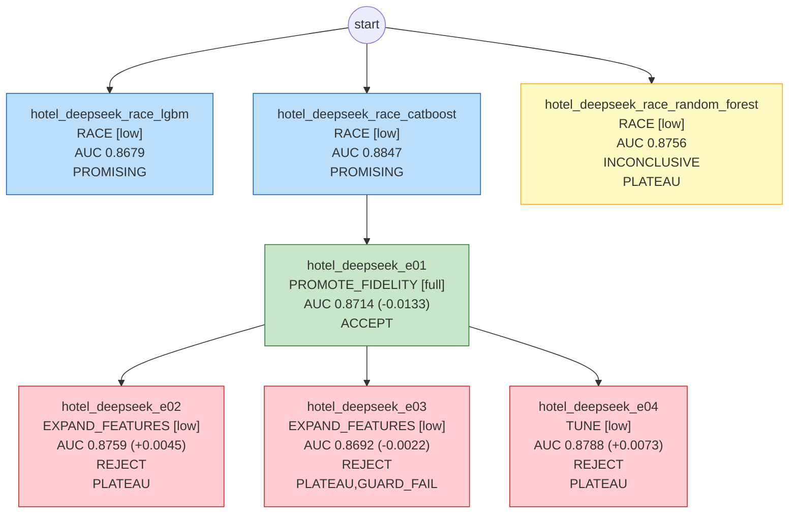

# 模型卡：hotel_deepseek

> 数据集 `hotel_bookings_sample`；本文档数据全部由代码生成。

## 执行摘要

本次预测任务基于酒店预订样本数据展开，用于支持预订相关的业务判断。我们先后尝试了 7 组建模方案，其中 1 组通过评估被采纳，5 组使用了时间外验证；由于继续尝试未能带来进一步提升，建模工作在此收尾。最终交付采用的是 CatBoost 模型。效果方面，时间外验证的区分能力得分为 0.8714，最终检验为 0.8385，两者较为接近，说明模型整体表现稳定。需要注意的是，最终检验结果略低于时间外验证，实际应用中的效果可能稍低于验证阶段的预期，建议上线后持续跟踪模型表现。

## 1. 任务规格

| 项 | 值 |
|---|---|
| label 定义 | is_canceled=1 表示这笔订单最终被取消（含未到店 No-Show）；=0 表示客人正常入住。 |
| 观察时间 | make_date(arrival_date_year::INTEGER, month(strptime(arrival_date_month, '%B')), arrival_date_day_of_month::INTEGER) - to_days(lead_time::INTEGER) |
| OOT 窗口 | {"oot_dev": ["2017-01", "2017-04"], "holdout": ["2017-05", "2017-08"]} |
| 目标指标 | auc（护栏 {'pr_auc': 0.02}，目标值 None） |
| 约束 | {'interpretability': 'none', 'max_features': None, 'banned_models': []} |
| 预算 | {'tokens': 200000.0, 'cpu_minutes': 240.0, 'wall_minutes': 120.0} |
| 自治级别 | L0 |

## 2. 数据切分

| 切分 | 样本数 | 正类比例 |
|---|---|---|
| train | 4,217 | 0.3597 |
| valid | 1,054 | 0.3691 |
| oot_dev | 1,239 | 0.3648 |
| holdout（仅 final_gate） | 1,487 | 0.4055 |

## 3. 最终模型

- 实验：`hotel_deepseek_e01`；模型：`catboost`；保真度：full；trial 数：5（剪枝 0）
- 特征数：24；最优参数：`{"depth": 5, "learning_rate": 0.18919384007644463, "l2_leaf_reg": 3.1580978938337103, "iterations": 303}`
- 赛跑打平：catboost、random_forest 在 OOT-dev 上与最优差距小于可分辨的最小提升（MDE 0.0152），效果相当；按偏好顺序（config race.tie_preference）推荐 catboost。

## 4. 各段指标

| 段 | **AUC** | PR_AUC | KS |
|---|---|---|---|
| train | **0.9698** | 0.9555 | 0.8005 |
| valid | **0.9163** | 0.8859 | 0.6691 |
| OOT-dev | **0.8714** | 0.8218 | 0.5686 |
| holdout | **0.8385** | 0.7815 | 0.5154 |

- valid − OOT-dev gap：0.0449；分数 PSI（valid→OOT-dev）：0.0617；OOT-dev 使用次数：5
- 补充参考指标（holdout，只报告、不参与选模型）：分数最高的头部 10% 里正类浓度是整体的 2.38 倍，覆盖 24% 的正类；Brier 分数 0.1638（越小说明预测概率越接近实际）

## 5. 分月 AUC、正类比例与分数 PSI

（月份按 `_split_time` 划分）

| 月份 | 段 | n | AUC | 正类比例 | 去年同期正类比例 | 分数 PSI（相对 valid） |
|---|---|---|---|---|---|---|
| 2017-01 | OOT-dev | 247 | 0.8772 | 0.340 | 0.247 | 0.1124 |
| 2017-02 | OOT-dev | 280 | 0.8428 | 0.325 | 0.345 | 0.1234 |
| 2017-03 | OOT-dev | 333 | 0.8772 | 0.336 | 0.307 | 0.0680 |
| 2017-04 | OOT-dev | 379 | 0.8801 | 0.435 | 0.379 | 0.1869 |
| 2017-05 | holdout | 423 | 0.8495 | 0.437 | 0.349 | |
| 2017-06 | holdout | 378 | 0.8709 | 0.431 | 0.395 | |
| 2017-07 | holdout | 356 | 0.8415 | 0.374 | 0.327 | |
| 2017-08 | holdout | 330 | 0.7851 | 0.370 | 0.360 | |

## 6. 特征清单（按平均 |SHAP| 排序）

| 特征 | 来源 | 定义/说明 | IV | 贡献占比 | 备注 |
|---|---|---|---|---|---|
| country | 原始字段 | 下单时即有的客源国，仅 0.3% 缺失。 | 0.738 | 15.2% |  |
| deposit_type | 原始字段 | 下单时确定的押金类型。 | 2.181 | 13.3% |  |
| lead_time | 原始字段 | 下单当天就能算出的提前预订天数，也是预测时点的来源。 | 0.625 | 10.8% |  |
| adr | 原始字段 | 下单时报价的平均每日房价，是收益管理的核心变量。 | 0.109 | 9.1% |  |
| market_segment | 原始字段 | 下单渠道类别，下单时确定。 | 0.340 | 8.7% |  |
| agent | 原始字段 | 下单时记录的代理商 ID，缺失 13.8%（无代理）。 | 0.330 | 8.5% |  |
| arrival_date_day_of_month | 原始字段 | 到店日在下单时就已知。 | 0.012 | 3.6% |  |
| arrival_date_week_number | 原始字段 | 到店周次在下单时就已知。 | 0.033 | 3.6% |  |
| arrival_date_month | 原始字段 | 到店月份在下单时就已知，反映旺淡季。 | 0.027 | 3.5% |  |
| customer_type | 原始字段 | 下单时确定的客户类型。 | 0.044 | 3.4% |  |
| stays_in_week_nights | 原始字段 | 预订时的住宿安排。 | 0.078 | 3.4% |  |
| meal | 原始字段 | 下单时选择的餐食方案。 | 0.022 | 3.0% |  |
| stays_in_weekend_nights | 原始字段 | 预订时的住宿安排。 | 0.002 | 2.3% |  |
| required_car_parking_spaces | 原始字段 | 下单时提出的停车位需求。 | 0.000 | 2.3% |  |
| reserved_room_type | 原始字段 | 下单时预订的房型。 | 0.047 | 2.0% |  |
| hotel | 原始字段 | 下单时就确定是哪家酒店。 | 0.104 | 1.5% |  |
| company | 原始字段 | 下单时就有的公司 ID，缺失 94.2% 按缺失单列处理。 | 0.076 | 1.3% |  |
| adults | 原始字段 | 下单时即确定的入住人数。 | 0.012 | 1.2% |  |
| previous_bookings_not_canceled | 原始字段 | 本单之前的历史成功入住次数，下单前已确定。 | 0.000 | 1.1% |  |
| distribution_channel | 原始字段 | 下单渠道，下单时确定。 | 0.111 | 1.1% |  |
| previous_cancellations | 原始字段 | 本单之前的历史取消次数，整列都是下单前已发生的事。 | 0.000 | 0.6% |  |
| children | 原始字段 | 下单时即确定的入住人数。 | 0.000 | 0.4% |  |
| is_repeated_guest | 原始字段 | 下单时依据历史入住记录即可判断。 | 0.000 | 0.2% |  |
| babies | 原始字段 | 下单时即确定的入住人数。 | 0.000 | 0.0% |  |

## 7. 实验树

| 实验 | 父节点 | 动作 | 保真度 | OOT-dev AUC | 判定 | 诊断码 |
|---|---|---|---|---|---|---|
| hotel_deepseek_race_lgbm | - | RACE | low | 0.8679 | PROMISING |  |
| hotel_deepseek_race_catboost | - | RACE | low | 0.8847 | PROMISING |  |
| hotel_deepseek_race_random_forest | - | RACE | low | 0.8756 | INCONCLUSIVE | PLATEAU |
| hotel_deepseek_e01 | hotel_deepseek_race_catboost | PROMOTE_FIDELITY | full | 0.8714 | ACCEPT |  |
| hotel_deepseek_e02 | hotel_deepseek_e01 | EXPAND_FEATURES | low | 0.8759 | REJECT | PLATEAU |
| hotel_deepseek_e03 | hotel_deepseek_e01 | EXPAND_FEATURES | low | 0.8692 | REJECT | PLATEAU,GUARD_FAIL |
| hotel_deepseek_e04 | hotel_deepseek_e01 | TUNE | low | 0.8788 | REJECT | PLATEAU |

## 8. 风险提示

- 分月 AUC 极差 0.095 > 0.05（sanity_rules）。注意月度样本量差异较大。
- 停止原因：NO_PROGRESS。

## 9. 模型设定（复现用）

用下面的设定，在同样的切分数据上可以重新训练出最终模型。

- 模型：catboost。高基数类别变量多时占优（原生处理类别，不需要编码）；有序提升对过拟合更克制。训练最慢。
- 训练：类别列转成字符串原样输入（缺失单独一类）；在 train 段训练，valid 段早停（连续 50 轮没有提升就停），实际用了 273 棵树；随机种子 0。
- 训练数据：train 段 4,217 行。train 和 valid 来自同一时期，valid 是从中随机抽出的 20%（种子 42）；时间外验证 2017-01 ~ 2017-04，最终检验 2017-05 ~ 2017-08。
- 参数怎么来的：Optuna（TPE）在 5 组参数里，选 valid 段 AUC 最高的一组。

| 参数 | 取值 | 含义 |
|---|---|---|
| depth | 5 | 每棵树的深度：越深越能拟合复杂关系，也越容易过拟合 |
| learning_rate | 0.189194 | 学习率：每棵树修正结果的幅度，越小越稳，但需要更多树 |
| l2_leaf_reg | 3.1581 | L2 正则：越大，叶子上的分数越向 0 收缩 |
| iterations | 303 | 最多训练的树数（早停可能提前结束） |

- 特征（24 个，按输入顺序）：`hotel`、`lead_time`、`arrival_date_month`、`arrival_date_week_number`、`arrival_date_day_of_month`、`stays_in_weekend_nights`、`stays_in_week_nights`、`adults`、`children`、`babies`、`meal`、`country`、`market_segment`、`distribution_channel`、`is_repeated_guest`、`previous_cancellations`、`previous_bookings_not_canceled`、`reserved_room_type`、`deposit_type`、`agent`、`company`、`customer_type`、`adr`、`required_car_parking_spaces`
- 派生特征的定义见特征清单。
