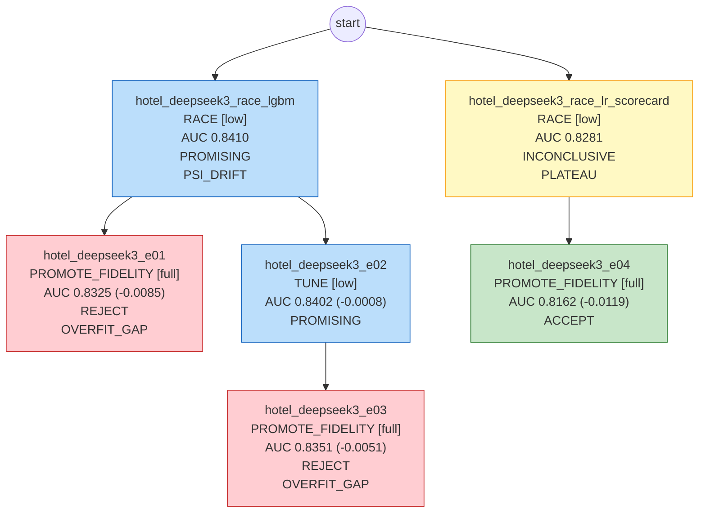

# 模型卡：hotel_deepseek3

> 数据集 `hotel_bookings`；本文档数据全部由代码生成。

## 执行摘要

（未生成摘要，或摘要中的数字无法在事实数据中核对，已丢弃。）

## 1. 任务规格

| 项 | 值 |
|---|---|
| label 定义 | 预订最终被取消（通常包含 No-Show），加载时用 reservation_status 校验该对应关系，校验后 reservation_status 立即剔除 |
| 观察时间列 | arrival_date - lead_time |
| OOT 窗口 | {"oot_dev": ["2017-01", "2017-04"], "holdout": ["2017-05", "2017-08"]} |
| 目标指标 | auc（目标值 None） |
| 约束 | {'interpretability': 'none', 'max_features': None, 'banned_models': []} |
| 预算 | {'tokens': 200000.0, 'cpu_minutes': 240.0, 'wall_minutes': 120.0} |
| 自治级别 | L0 |

## 2. 数据切分

| 切分 | 样本数 | 坏样本率 |
|---|---|---|
| train | 4,217 | 0.3597 |
| valid | 1,054 | 0.3691 |
| oot_dev | 1,239 | 0.3648 |
| holdout（仅 final_gate） | 1,487 | 0.4055 |

## 3. 最终模型

- 实验：`hotel_deepseek3_e04`；模型：`lr_scorecard`；保真度：full；trial 数：10（剪枝 0）
- 特征数：27；最优参数：`{"C": 7.155682161754866, "n_bins": 11}`

## 4. 各段指标

| 段 | AUC | KS |
|---|---|---|
| train | 0.8192 | |
| valid | 0.8216 | |
| OOT-dev | 0.8162 | 0.4561 |
| holdout | 0.7305 | 0.3348 |

- valid − OOT-dev gap：0.0054；分数 PSI（valid→OOT-dev）：0.0511；OOT-dev 使用次数：1

## 5. 分月 AUC、坏样本率与分数 PSI

（月份按 `_split_time` 划分）

| 月份 | 段 | n | AUC | 坏样本率 | 去年同期坏样本率 | 分数 PSI（相对 valid） |
|---|---|---|---|---|---|---|
| 2017-01 | OOT-dev | 247 | 0.8648 | 0.340 | 0.247 | 0.1658 |
| 2017-02 | OOT-dev | 280 | 0.7905 | 0.325 | 0.345 | 0.2227 |
| 2017-03 | OOT-dev | 333 | 0.7854 | 0.336 | 0.307 | 0.0415 |
| 2017-04 | OOT-dev | 379 | 0.8174 | 0.435 | 0.379 | 0.1071 |
| 2017-05 | holdout | 423 | 0.7618 | 0.437 | 0.349 | |
| 2017-06 | holdout | 378 | 0.7480 | 0.431 | 0.395 | |
| 2017-07 | holdout | 356 | 0.7170 | 0.374 | 0.327 | |
| 2017-08 | holdout | 330 | 0.6819 | 0.370 | 0.360 | |

> 酒店业务季节性很强：oot_dev 覆盖冬春，holdout 覆盖夏季。OOT 上的漂移有一部分来自季节而非模型退化， 报告中需要按月份对比同期（2016 年同月）的坏样本率，区分季节效应与真实漂移。

## 6. 特征清单（按平均 |SHAP| 排序）

| 特征 | 来源 | 定义/说明 | IV | 贡献占比 | 备注 |
|---|---|---|---|---|---|
| deposit_type | 原始字段 | 数据中 Non Refund 的取消率反直觉地高（可能与团体/渠道订单有关）。critic 标注但不自动剔除 | 2.181 | 32.9% |  |
| lead_time | 原始字段 | numeric | 0.625 | 12.5% |  |
| customer_type | 原始字段 | categorical | 0.044 | 9.1% |  |
| cancel_history_ratio | 派生特征（classic_derived） | previous_cancellations / nullif(previous_cancellations + previous_book | 0.285 | 8.6% |  |
| agent | 原始字段 | ID，高基数，含 NULL 字符串 | 0.804 | 7.3% |  |
| company | 原始字段 | ID，高基数，大量 NULL | 0.066 | 4.2% |  |
| adults | 原始字段 | numeric | 0.012 | 4.1% |  |
| hotel | 原始字段 | categorical | 0.104 | 3.2% |  |
| total_guests | 派生特征（classic_derived） | adults + coalesce(children, 0) + babies | 0.028 | 3.0% |  |
| meal | 原始字段 | Undefined 与 SC 含义相同，合并 | 0.022 | 2.9% |  |
| arrival_date_day_of_month | 原始字段 | numeric | 0.012 | 2.5% |  |
| market_segment | 原始字段 | categorical | 0.340 | 2.1% |  |
| distribution_channel | 原始字段 | categorical | 0.111 | 1.8% |  |
| total_nights | 派生特征（classic_derived） | stays_in_weekend_nights + stays_in_week_nights | 0.107 | 1.6% |  |
| weekend_share | 派生特征（classic_derived） | stays_in_weekend_nights / nullif(total_nights, 0) | 0.034 | 1.0% |  |
| reserved_room_type | 原始字段 | categorical | 0.047 | 1.0% |  |
| stays_in_week_nights | 原始字段 | 同上 | 0.078 | 0.8% |  |
| arrival_date_week_number | 原始字段 | numeric | 0.033 | 0.8% |  |
| booking_month | 派生特征（classic_derived） | month(arrival_date - to_days(lead_time::int)) | 0.029 | 0.3% |  |
| stays_in_weekend_nights | 原始字段 | 对已入住的订单，可能反映实际入住晚数而非预订晚数；列入审查 | 0.002 | 0.3% |  |
| arrival_date_month | 原始字段 | categorical | 0.027 | 0.1% |  |
| children | 原始字段 | 有少量缺失 | 0.000 | 0.0% |  |
| babies | 原始字段 | numeric | 0.000 | 0.0% |  |
| is_repeated_guest | 原始字段 | binary | 0.000 | 0.0% |  |
| previous_cancellations | 原始字段 | numeric | 0.000 | 0.0% |  |
| previous_bookings_not_canceled | 原始字段 | numeric | 0.000 | 0.0% |  |
| has_kids | 派生特征（classic_derived） | coalesce(children, 0) + babies > 0 | 0.000 | 0.0% |  |

## 7. 实验树

| 实验 | 父节点 | 动作 | 保真度 | OOT-dev AUC | 判定 | 诊断码 |
|---|---|---|---|---|---|---|
| hotel_deepseek3_race_lgbm | - | RACE | low | 0.8410 | PROMISING | PSI_DRIFT |
| hotel_deepseek3_race_lr_scorecard | - | RACE | low | 0.8281 | INCONCLUSIVE | PLATEAU |
| hotel_deepseek3_e01 | hotel_deepseek3_race_lgbm | PROMOTE_FIDELITY | full | 0.8325 | REJECT | OVERFIT_GAP |
| hotel_deepseek3_e02 | hotel_deepseek3_race_lgbm | TUNE | low | 0.8402 | PROMISING |  |
| hotel_deepseek3_e03 | hotel_deepseek3_e02 | PROMOTE_FIDELITY | full | 0.8351 | REJECT | OVERFIT_GAP |
| hotel_deepseek3_e04 | hotel_deepseek3_race_lr_scorecard | PROMOTE_FIDELITY | full | 0.8162 | ACCEPT |  |

## 8. 风险提示

- holdout AUC 比 OOT-dev 低 0.0857，超过 δ=0.02：**疑似对 OOT-dev 过拟合**。
- 分月 AUC 极差 0.183 > 0.05（sanity_rules）。注意月度样本量差异较大。
- 停止原因：LLM_STOP: 已存在被 ACCEPT 的全保真最终模型 hotel_deepseek3_e04 (lr_scorecard, oot_dev_auc=0.8162, gap=0.0054)，final_model.exists=true 且 promotable 为空。剩余 1 轮内唯一可提升路径是 lgbm 全保真复验，但 lgbm 两次全保真复验（e01 gap=0.0406、e03 gap=0.0369）均因 OVERFIT_GAP 被拒，低保真 lgbm 的 gap 也达 0.0204，全量复验大概率再次超阈值；而 lr_scorecard 已 ACCEPT，无更高保真可升。继续投入的期望价值低于成本。。
