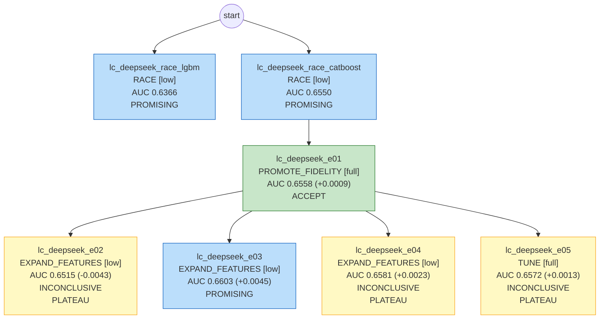

# 模型卡：lc_deepseek

> 数据集 `lending_club`；本文档数据全部由代码生成。

## 执行摘要

这次建模要解决的是借贷场景下的客户风险预测问题，最终产出是一个可以给客户按风险高低排序的模型。我们一共尝试了 7 组建模方案，其中 5 组用时间外数据做了验证和比较，最后只保留并采纳了 1 组方案。最终选用的模型是 CatBoost，它在达到预设的最大迭代轮数后自动停止训练，没有继续往下跑。从效果看，该模型在时间外验证上的区分能力得分为 0.6558，在最终检验上为 0.6669，两者比较接近，说明模型表现相对稳定，最终检验的结果还略好于时间外验证。需要提醒的是，整体区分能力属于中等水平，距离理想状态仍有提升空间，建议实际使用时不要单独依赖模型结论，而是结合业务规则、人工复核和其他信息共同决策，并持续跟踪上线后的真实表现。

## 1. 任务规格

| 项 | 值 |
|---|---|
| label 定义 | 贷款最终状态：Charged Off（核销）视为违约=正类，Fully Paid（还清）视为正常=负类；数据中只有这两类。 |
| 观察时间 | strptime(issue_d, '%b-%Y') |
| OOT 窗口 | {"oot_dev": ["2015-01", "2015-06"], "holdout": ["2015-07", "2015-12"]} |
| 目标指标 | auc（护栏 {'ks': 0.02}，目标值 None） |
| 约束 | {'interpretability': 'none', 'max_features': None, 'banned_models': []} |
| 预算 | {'tokens': 200000.0, 'cpu_minutes': 240.0, 'wall_minutes': 120.0} |
| 自治级别 | L0 |

## 2. 数据切分

| 切分 | 样本数 | 正类比例 |
|---|---|---|
| train | 24,954 | 0.1316 |
| valid | 6,238 | 0.1359 |
| oot_dev | 12,293 | 0.1513 |
| holdout（仅 final_gate） | 16,513 | 0.1471 |

## 3. 最终模型

- 实验：`lc_deepseek_e01`；模型：`catboost`；保真度：full；trial 数：5（剪枝 0）
- 特征数：35；最优参数：`{"depth": 4, "learning_rate": 0.04684978151901601, "l2_leaf_reg": 5.266850583229664, "iterations": 732}`

## 4. 各段指标

| 段 | **AUC** | PR_AUC | KS |
|---|---|---|---|
| train | **0.7116** | 0.3029 | 0.3071 |
| valid | **0.6529** | 0.2166 | 0.2222 |
| OOT-dev | **0.6558** | 0.2329 | 0.2368 |
| holdout | **0.6669** | 0.2381 | 0.2539 |

- valid − OOT-dev gap：-0.0029；分数 PSI（valid→OOT-dev）：0.0022；OOT-dev 使用次数：5
- 补充参考指标（holdout，只报告、不参与选模型）：分数最高的头部 10% 里正类浓度是整体的 1.90 倍，覆盖 19% 的正类；Brier 分数 0.1207（越小说明预测概率越接近实际）

## 5. 分月 AUC、正类比例与分数 PSI

（月份按 `_split_time` 划分）

| 月份 | 段 | n | AUC | 正类比例 | 去年同期正类比例 | 分数 PSI（相对 valid） |
|---|---|---|---|---|---|---|
| 2015-01 | OOT-dev | 2405 | 0.6502 | 0.149 | 0.125 | 0.0109 |
| 2015-02 | OOT-dev | 1631 | 0.6498 | 0.142 | 0.129 | 0.0048 |
| 2015-03 | OOT-dev | 1721 | 0.6585 | 0.154 | 0.132 | 0.0046 |
| 2015-04 | OOT-dev | 2404 | 0.6551 | 0.156 | 0.134 | 0.0041 |
| 2015-05 | OOT-dev | 2192 | 0.6385 | 0.152 | 0.133 | 0.0059 |
| 2015-06 | OOT-dev | 1940 | 0.6867 | 0.154 | 0.139 | 0.0068 |
| 2015-07 | holdout | 3141 | 0.6636 | 0.146 | 0.135 | |
| 2015-08 | holdout | 2436 | 0.6794 | 0.142 | 0.135 | |
| 2015-09 | holdout | 1910 | 0.6876 | 0.149 | 0.141 | |
| 2015-10 | holdout | 3378 | 0.6564 | 0.142 | 0.149 | |
| 2015-11 | holdout | 2570 | 0.6648 | 0.148 | 0.142 | |
| 2015-12 | holdout | 3078 | 0.6607 | 0.156 | 0.137 | |

## 6. 特征清单（按平均 |SHAP| 排序）

| 特征 | 来源 | 定义/说明 | IV | 贡献占比 | 备注 |
|---|---|---|---|---|---|
| annual_inc | 原始字段 | 借款人年收入，申请时已知。 | 0.096 | 12.5% |  |
| fico_range_high | 原始字段 | 申请时 FICO 评分区间上界。 | 0.147 | 8.5% |  |
| dti | 原始字段 | 负债收入比，审批时已知。 | 0.048 | 8.5% |  |
| fico_range_low | 原始字段 | 申请时 FICO 评分区间下界。 | 0.147 | 6.9% |  |
| inq_last_6mths | 原始字段 | 近 6 个月征信查询次数，申请时已知。 | 0.022 | 6.0% |  |
| open_acc | 原始字段 | 当前开放信贷账户数，申请时已知。 | 0.003 | 5.4% |  |
| purpose | 原始字段 | 借款用途，申请时已知。 | 0.025 | 5.4% |  |
| funded_amnt | 原始字段 | 审批确定的放款金额，放款决策时已知，用户已确认不算泄漏。 | 0.016 | 5.1% |  |
| revol_util | 原始字段 | 循环额度使用率，申请时已知，缺失 0.06%。 | 0.029 | 5.0% |  |
| tot_cur_bal | 原始字段 | 全部账户当前余额，申请时征信快照，缺失 3.83%。 | 0.064 | 4.4% |  |
| loan_amnt | 原始字段 | 申请人填写的借款金额，审批时已知。 | 0.016 | 4.4% |  |
| home_ownership | 原始字段 | 住房情况，申请时已知。 | 0.042 | 3.7% |  |
| revol_bal | 原始字段 | 循环额度已用余额，申请时已知。 | 0.016 | 3.2% |  |
| emp_length | 原始字段 | 借款人自填工作年限，申请时已知，缺失 6.1%。 | 0.030 | 3.1% |  |
| verification_status | 原始字段 | 收入核验状态，审批时已知。 | 0.010 | 2.8% |  |
| total_rev_hi_lim | 原始字段 | 循环额度总额度，申请时征信快照，缺失 3.83%。 | 0.053 | 2.7% |  |
| mths_since_last_delinq | 原始字段 | 距上次逾期的月数，申请时征信快照，缺失 50.7%。 | 0.005 | 2.5% |  |
| mths_since_last_record | 原始字段 | 距上次信贷不良记录的月数，申请时已知，缺失 83.1%。 | 0.011 | 2.0% |  |
| earliest_cr_line | 原始字段 | 最早信用卡开户月份，字符串格式（如 May-2000），不能直接解析为日期，按分类处理，申请时已知。 | 0.188 | 1.9% |  |
| total_acc | 原始字段 | 信贷账户总数，申请时已知。 | 0.009 | 1.8% |  |
| addr_state | 原始字段 | 借款人所在州，申请时已知。 | 0.019 | 1.2% |  |
| delinq_2yrs | 原始字段 | 申请时征信报告中的过去两年逾期次数。 | 0.003 | 1.0% |  |
| tot_coll_amt | 原始字段 | 催收欠款总额，申请时征信快照，缺失 3.83%。 | 0.003 | 0.9% |  |
| initial_list_status | 原始字段 | 初始挂牌状态，放款时确定，审批时已知。 | 0.001 | 0.6% |  |
| pub_rec | 原始字段 | 公共不良记录数，申请时已知。 | 0.001 | 0.2% |  |
| pub_rec_bankruptcies | 原始字段 | 破产记录数，申请时已知。 | 0.002 | 0.2% |  |
| collections_12_mths_ex_med | 原始字段 | 近 12 个月医疗类催收次数，申请时已知。 | 0.000 | 0.2% |  |
| acc_now_delinq | 原始字段 | 当前逾期账户数，申请时已知。 | 0.000 | 0.0% |  |
| term | 原始字段 | 贷款期限，本数据只有 36 months 一个取值，无区分度但仍可在审批时获得。 | 0.000 | 0.0% |  |
| application_type | 原始字段 | 个人或共同申请，申请时已知。 | 0.000 | 0.0% |  |
| open_acc_6m | 原始字段 | 放款时征信快照，用户确认可用；平台 2015 年底前多数未采集，缺失 97.5%，按缺失值处理。 | 0.000 | 0.0% |  |
| open_il_12m | 原始字段 | 放款时征信快照，用户确认可用；缺失 97.5%，按缺失值处理。 | 0.000 | 0.0% |  |
| il_util | 原始字段 | 分期额度使用率，放款时征信快照，用户确认可用；缺失 97.8%。 | 0.000 | 0.0% |  |
| all_util | 原始字段 | 全部额度使用率，放款时征信快照，用户确认可用；缺失 97.5%。 | 0.000 | 0.0% |  |
| inq_last_12m | 原始字段 | 近 12 个月征信查询次数，放款时征信快照，用户确认可用；缺失 97.5%。 | 0.000 | 0.0% |  |

## 7. 实验树

| 实验 | 父节点 | 动作 | 保真度 | OOT-dev AUC | 判定 | 诊断码 |
|---|---|---|---|---|---|---|
| lc_deepseek_race_lgbm | - | RACE | low | 0.6366 | PROMISING |  |
| lc_deepseek_race_catboost | - | RACE | low | 0.6550 | PROMISING |  |
| lc_deepseek_e01 | lc_deepseek_race_catboost | PROMOTE_FIDELITY | full | 0.6558 | ACCEPT |  |
| lc_deepseek_e02 | lc_deepseek_e01 | EXPAND_FEATURES | low | 0.6515 | INCONCLUSIVE | PLATEAU |
| lc_deepseek_e03 | lc_deepseek_e01 | EXPAND_FEATURES | low | 0.6603 | PROMISING |  |
| lc_deepseek_e04 | lc_deepseek_e01 | EXPAND_FEATURES | low | 0.6581 | INCONCLUSIVE | PLATEAU |
| lc_deepseek_e05 | lc_deepseek_e01 | TUNE | full | 0.6572 | INCONCLUSIVE | PLATEAU |

## 8. 风险提示

- 停止原因：MAX_ROUNDS。

## 9. 模型设定（复现用）

用下面的设定，在同样的切分数据上可以重新训练出最终模型。

- 模型：catboost。高基数类别变量多时占优（原生处理类别，不需要编码）；有序提升对过拟合更克制。训练最慢。
- 训练：类别列转成字符串原样输入（缺失单独一类）；在 train 段训练，valid 段早停（连续 50 轮没有提升就停），实际用了 391 棵树；随机种子 0。
- 训练数据：train 段 24,954 行。train 和 valid 来自同一时期，valid 是从中随机抽出的 20%（种子 42）；时间外验证 2015-01 ~ 2015-06，最终检验 2015-07 ~ 2015-12。
- 参数怎么来的：Optuna（TPE）在 5 组参数里，选 valid 段 AUC 最高的一组。

| 参数 | 取值 | 含义 |
|---|---|---|
| depth | 4 | 每棵树的深度：越深越能拟合复杂关系，也越容易过拟合 |
| learning_rate | 0.0468498 | 学习率：每棵树修正结果的幅度，越小越稳，但需要更多树 |
| l2_leaf_reg | 5.26685 | L2 正则：越大，叶子上的分数越向 0 收缩 |
| iterations | 732 | 最多训练的树数（早停可能提前结束） |

- 特征（35 个，按输入顺序）：`loan_amnt`、`funded_amnt`、`term`、`emp_length`、`home_ownership`、`annual_inc`、`verification_status`、`purpose`、`addr_state`、`dti`、`delinq_2yrs`、`earliest_cr_line`、`fico_range_low`、`fico_range_high`、`inq_last_6mths`、`mths_since_last_delinq`、`mths_since_last_record`、`open_acc`、`pub_rec`、`revol_bal`、`revol_util`、`total_acc`、`initial_list_status`、`collections_12_mths_ex_med`、`application_type`、`acc_now_delinq`、`tot_coll_amt`、`tot_cur_bal`、`open_acc_6m`、`open_il_12m`、`il_util`、`all_util`、`total_rev_hi_lim`、`inq_last_12m`、`pub_rec_bankruptcies`
- 派生特征的定义见特征清单。
